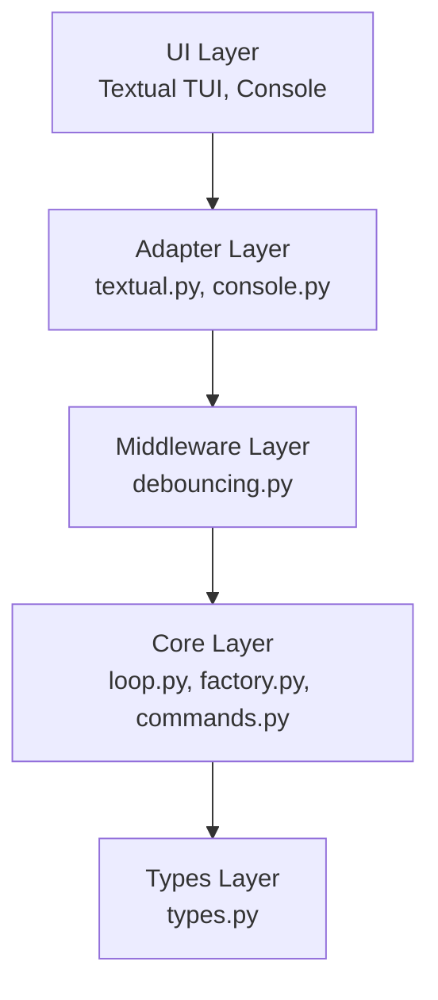
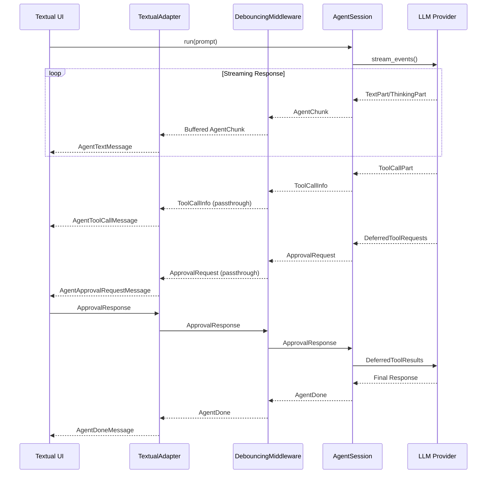
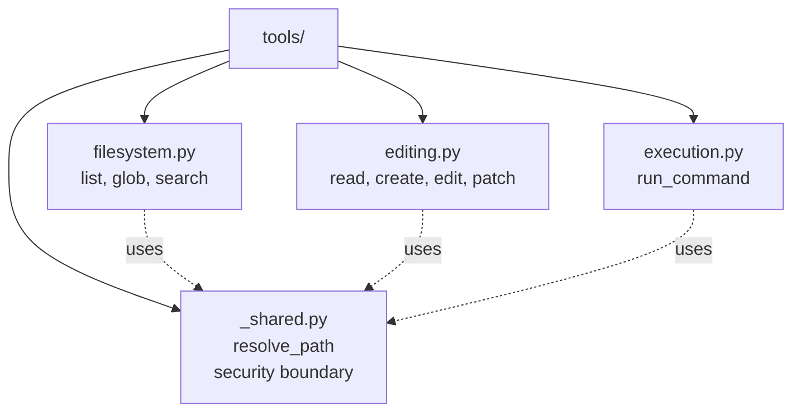

# Agent C Architecture

Agent C uses a layered, event-driven architecture that keeps concerns separated and testable.

## Layered Architecture



### Key Principles

- **Unidirectional dependencies**: Lower layers never import from higher layers
- **Type-driven boundaries**: All cross-layer data uses typed dataclasses from `types.py`
- **Framework-agnostic core**: Core logic has no knowledge of UI frameworks

### Layer Responsibilities

**Types Layer** (`types.py`)
- Central `AgentEvent` union (chunks, tool calls, tool results, approvals, done)
- `AgentSessionProtocol` interface
- Shared dataclasses for cross-layer communication
- `CommandEffect` for effect-based command execution
- `BackendConfig` and `ModelConfig` for backend/model presets

**Core Layer** (`core/`)
- `loop.py`: `AgentSession` implementing bidirectional async generator loop
- `factory.py`: Agent creation with model presets, tools, and skills
- `commands.py`: Command parsing and effect-based execution
- `tools/`: Tool implementations (filesystem, editing, execution)
- `skill_loader.py`: Skill discovery from bundled and project directories
- `provider_loader.py`: Dynamic provider/model loading from TOML configs

**Middleware Layer** (`middleware/`)
- `debouncing.py`: Text/thinking delta aggregation (40 char threshold default)

**Adapter Layer** (`adapters/`)
- `textual.py`: Translates `AgentEvent` to Textual messages
- `console.py`: Translates `AgentEvent` to console callbacks
- Owns UI-specific message types and approval handshake coordination

**UI Layer** (`ui/`)
- `textual_app.py`: Textual TUI application
- `run_textual.py`: Textual UI entry point
- `run_console.py`: Console UI demo entry point
- `widgets.py`: Reusable UI components

## Event Flow



### Event Flow Steps

1. **`AgentSession.run()`** streams pydantic_ai events using current history and optional deferred tool approvals
2. **Core layer** maps pydantic_ai parts into `AgentEvent` items, including tool call results for UI display
3. **`DebouncingMiddleware`** aggregates small text/thinking deltas (buffered until threshold), while passing tool calls, tool results, approvals, and completion events through immediately
4. **Adapters** consume the debounced stream, convert events to UI messages/callback events, and perform the approval handshake by sending an `ApprovalResponse` back via `asend`

## Command Execution Pattern

User commands follow an effect-based pattern that separates parsing, execution logic, and UI concerns:

1. **`CommandParser.parse(user_input)`** → `CommandResult` (parsed command with type and args)
2. **`execute_command(result)`** → `CommandEffect | None` (pure data: new session, notification, reset flag)
3. **UI applies the effect**: updates session, displays notification, resets state

Supported commands: `/clear`, `/reset`, `/exit`, `/quit`, `/bye`, `/model <name>`, `/help`

Framework-specific commands (`/exit`, unknown commands) return `None` and are handled directly by the UI layer.

## Tools Package Structure



Tools are organized by responsibility:

### Shared Utilities (`_shared.py`)
- **`resolve_path`**: Path validation and security sandboxing (primary security boundary)
- Ensures all file operations are confined to configured root directories
- Resolves symlinks and normalizes paths

### Filesystem Operations (`filesystem.py`)
- **`list_files`**: List directory contents with gitignore support
- **`glob_paths`**: Find files matching patterns recursively
- **`search_files`**: Search for text in files with line-level matches
- Respects `.gitignore` and default ignore patterns (`.git/`, `__pycache__/`, etc.)
- Results capped at 200 lines with truncation summary

### File Editing (`editing.py`)
- **`read_file`**: Read with `cat -n` style line numbers
- **`create_file`**: Create new files with atomic writes (**requires approval**)
- **`edit_file`**: Replace unique string occurrence (**requires approval**)
- **`apply_hunks`**: Apply structured patches atomically (**requires approval**)
- Atomic writes via temp files
- Timestamped backups (`.bak`) before modifications
- Transactional: all hunks must match or no files are modified

### Command Execution (`execution.py`)
- **`run_command`**: Execute shell commands asynchronously (**requires approval**)
- Uses `asyncio.create_subprocess_shell` with stdin piped
- Returns captured stdout/stderr

## Skills System

`SkillLoader` scans for `SKILL.md` descriptors in:
- Bundled skills (installed to user data directory on first run)
- Project directories (`.github/skills` and `.claude/skills` by default)
- User directory (`~/.agentc/skills`)

Earlier directories take precedence. `create_agent` injects a table of discovered skills into the system prompt, with guidance to `cd` into the skill base directory before running documented commands.

## Configuration & Provider System

### Provider Discovery

Agent C discovers `providers.toml` files in priority order:

1. **Repo-local**: `.agentc/providers.toml` (highest priority)
2. **User-global**: `~/.agentc/providers.toml`
3. **Bundled**: `src/agentc/providers.toml` (lowest priority)

Entries from earlier locations override those with the same name later.

### Provider Loader (`core/provider_loader.py`)

- **`get_default_provider_dirs()`**: Returns discovery paths in priority order
- **`load_providers(dirs)`**: Discovers and merges backend/model presets with precedence
- **`build_model(model_config, backend_config)`**: Dynamically imports provider/model classes, applies params, passes API key/base URL overrides

### Example Configuration

```toml
[backends.ollama]
provider_cls = "pydantic_ai.providers.ollama.OllamaProvider"
model_cls = "pydantic_ai.models.openai.OpenAIChatModel"
base_url = "http://localhost:11434/v1"

[models.local-oss]
backend = "ollama"
model_name = "gpt-oss:120b-cloud"
params = {temperature = 0.2}
```

## Design Principles

1. **Separation of Concerns**: Each layer has a single, well-defined responsibility
2. **Dependency Inversion**: Core logic depends on abstractions (protocols), not concrete implementations
3. **Type Safety**: Full type annotations with MyPy strict mode
4. **Testability**: Each layer can be tested in isolation with clear interfaces
5. **Event-Driven**: Async generators enable streaming, cancellation, and backpressure
6. **Approval Handshake**: Bidirectional communication via `asend` for tool approval workflow
7. **Effect-Based Commands**: Pure data output from command execution, UI applies side effects

## See Also

- [AGENTS.md](AGENTS.md) - Development rules and coding standards
- [README.md](README.md) - User guide and quick start
