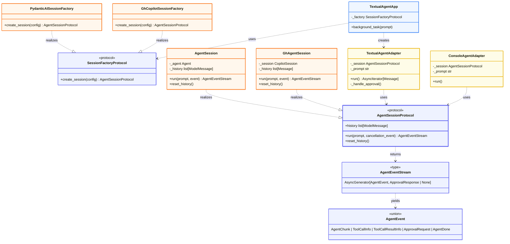

# Agent C — Class Diagram (UML)

Protocols owned by Core, implemented by Backends, used by Adapters

## Key Relationships

**Realization** (dotted line with hollow arrow `...|>`):
- Backend classes IMPLEMENT the protocols defined by Core
- `AgentSession` and `GhAgentSession` realize `AgentSessionProtocol`
- Factory classes realize `SessionFactoryProtocol`

**Dependency** (dotted line with arrow `..>`):
- Adapters and UI DEPEND ON protocols (use them via interfaces)
- `TextualAgentAdapter` uses `AgentSessionProtocol` (doesn't care which implementation)
- `TextualAgentApp` uses `SessionFactoryProtocol` to create sessions

**Core Principle**:
- Core layer OWNS protocols (`AgentSessionProtocol`, `AgentEventStream`, `AgentEvent`)
- Backends REALIZE protocols (provide concrete implementations)
- Adapters/UI DEPEND on protocols (consume via abstract interfaces)
- Dependencies point toward abstractions, not implementations
