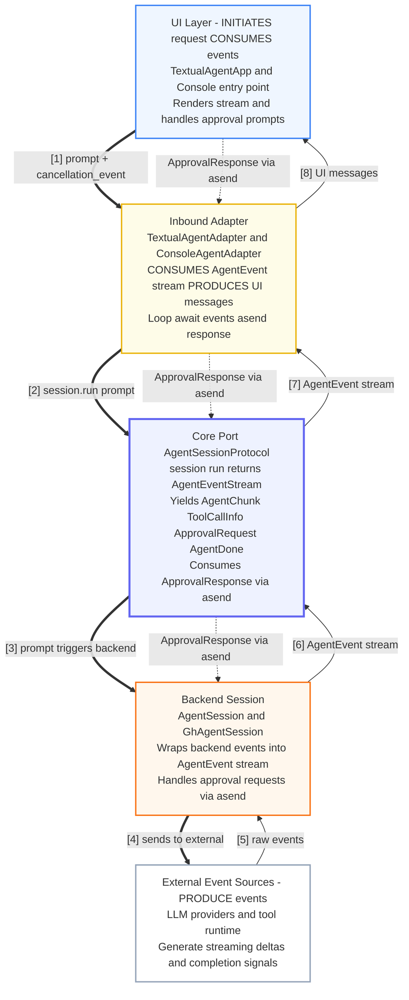

# Agent C — Layered Streaming Pipeline (Bidirectional Async Generator)

UI initiates requests at the top; external systems at the bottom produce events that flow UP through layers; approval decisions flow DOWN via asend().



## Key Pattern: "Run a Request" = "Stream Events"

**Request initiation flows DOWN (UI → External)**:
1. User enters prompt in UI (top layer)
2. UI creates adapter with prompt and `cancellation_event`
3. Adapter calls `session.run(prompt, cancellation_event)`
4. Core port invokes backend session
5. Backend sends prompt to external LLM/tool systems (bottom layer)

**Events flow UP in response (External → UI)**:
6. External systems produce streaming events (bottom layer)
7. Backend wraps them as `AgentEvent` stream
8. Core port enforces protocol contract
9. Adapter translates to UI messages
10. UI renders to screen (top layer)

**Approval responses flow DOWN** via `asend()`:
- When backend needs approval (e.g., tool execution), it yields `ApprovalRequest` that flows UP
- UI prompts user for approval decision
- Decision flows DOWN through each layer via `asend()`
- Backend receives `ApprovalResponse` and continues execution

**Cancellation**:
- UI's `cancellation_event` can interrupt the stream at any layer

Each layer repeats the same async generator pattern:
```python
async def process(events: AgentEventStream) -> AgentEventStream:
    response = None
    while True:
        event = await events.asend(response)
        response = None
        # Transform event, possibly obtain approval
        yield transformed_event
```
