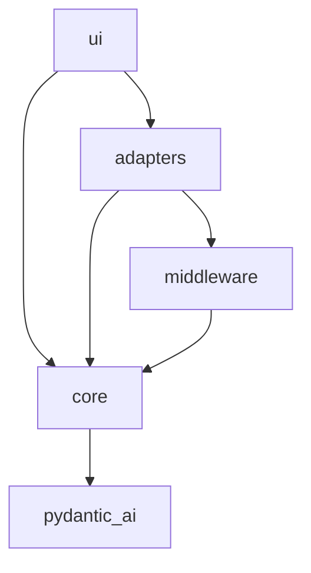
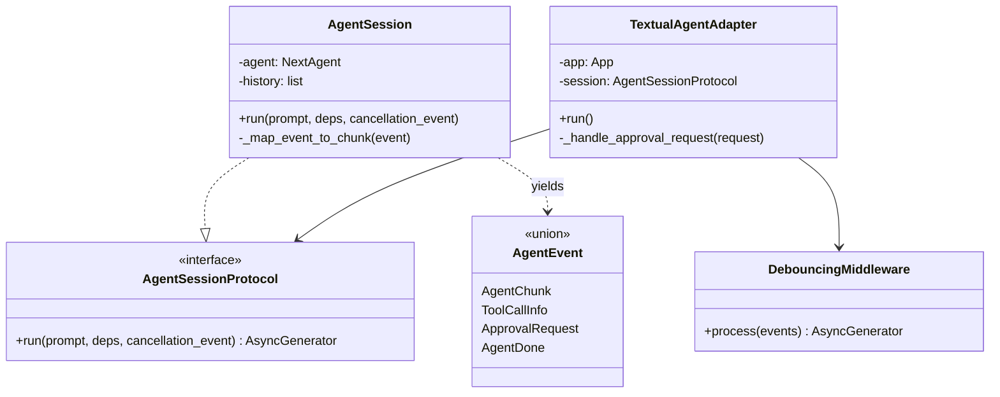
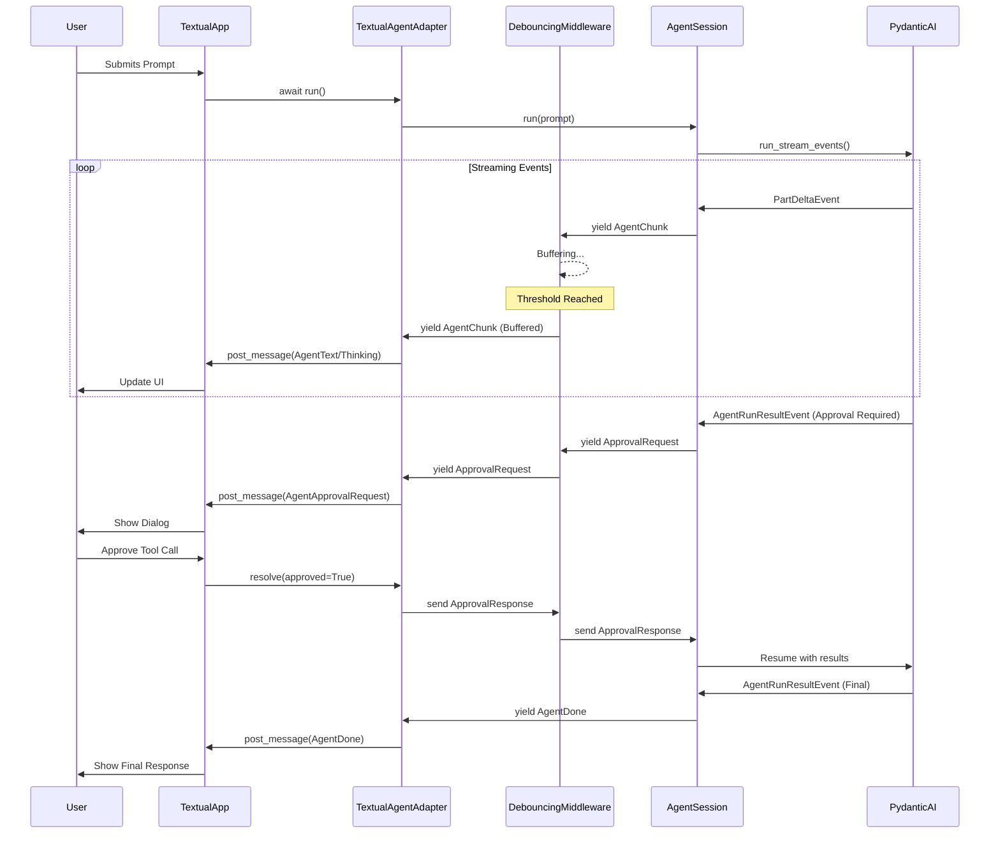

# AgentC Next Generation

This directory contains the next generation of AgentC: a decoupled architecture for a tool-augmented agent with multiple UI implementations.

## Overview

AgentC Next separates the core agentic loop from the UI layer using an event-driven approach. It leverages `pydantic_ai` for the agent implementation but wraps it in an agnostic event stream that can be consumed by different adapters (Textual, Console, etc.).

### Quick Architectural Summary

**One Word:** Pipelined

**One Sentence:** `agentc_next` is an event-driven pipeline architecture where a core agentic loop yields framework-agnostic events that flow through optional middleware and are adapted into framework-specific UI messages.

**Full Description:** `agentc_next` is a layered, event-driven architecture that decouples the core agentic logic from UI implementations through an async generator-based event pipeline. At its foundation, an `AgentSession` wraps a `pydantic_ai` agent and yields framework-agnostic events (`AgentChunk`, `ToolCallInfo`, `ApprovalRequest`, `AgentDone`) that represent the agent's thinking, outputs, and decisions. These events flow through an optional middleware layer (like `DebouncingMiddleware`) that can buffer or transform the stream while preserving the async send/receive protocol for approval handshakes. Finally, framework-specific adapters (like `TextualAgentAdapter`) consume this event stream and translate core events into framework-specific messages (Textual `Message` subclasses) that the UI layer consumes. This design completely decouples agent logic from presentation, enabling multiple UI implementations while keeping the core stateless and reusable.

## Architecture Diagrams

### Dependency Graph

The project is structured to minimize tight coupling, with dependencies flowing towards the core logic.



### Class Diagram

Key classes and their relationships:



### Typical Conversation Sequence

This diagram shows the flow of a user prompt through the layers, including a tool approval cycle.



## Key Components

- **`core/`**: Contains the `AgentSession` and the agnostic event types. It encapsulates the interaction with `pydantic_ai`.
- **`adapters/`**: Bridges the core event stream to specific UI frameworks. The `TextualAgentAdapter` converts `AgentEvent` objects into Textual `Message` objects.
- **`middleware/`**: Intermediaries that can transform the event stream. The `DebouncingMiddleware` aggregates small text deltas to prevent UI flickering.
- **`ui/`**: Concrete UI implementations. `run_textual.py` launches the full interactive terminal application.

## Getting Started

You can run the different UI variants using the following commands:

```powershell
# Run the Textual UI
python -m agentc_next.ui.run_textual

# Run the Console UI
python -m agentc_next.ui.run_console
```
